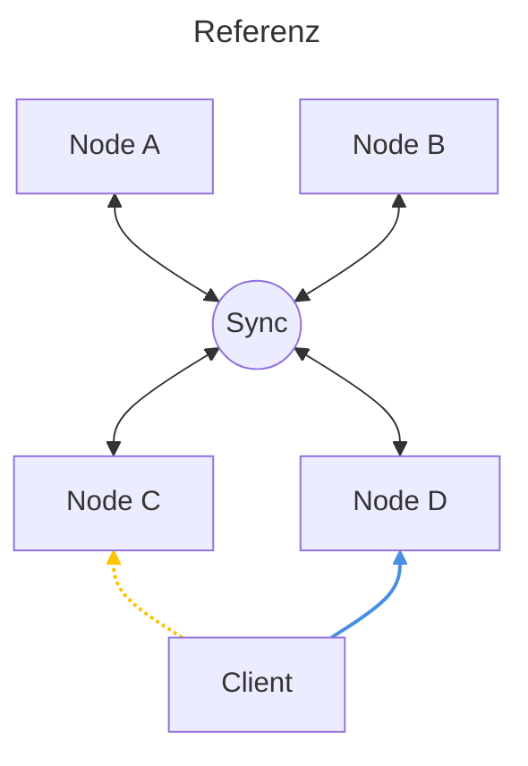

# ANGABE TEVS ABSCHLUSSARBEIT

Zusätzlich zu den Vorlesungen der Lehrveranstaltung "Technologien verteilter Systeme" sollen Sie in Form einer Projektarbeit eine Abschlussarbeit fertigen.

## PROGRAMMIER-PROJEKT

* **Personenanzahl:** maximal 3 Personen.

Als Abschlussarbeit soll eine verteilte Applikation entwickelt werden, dessen Backend aus mehreren gleichwertigen Serviceinstanzen besteht. Über einen Client muss es möglich sein ein entferntes Objekt mit mehreren Attributen verteilt zu erstellen, verändern, löschen und abzurufen. Zur Erhaltung einer hohen Verfügbarkeit muss es möglich sein, dass mehrere Backend-Serviceinstanzen, welche die Objekte halten, redundant über mehre Server (Nodes) ausgeführt werden. Im Falle eines Ausfalls einer Backend-Serviceinstanz soll der Client-Dienst keine merkbaren Auswirkungen (Ausfälle, Datenverlust) haben. Ebenfalls soll durch die Replikation der Objekte kein Datenverlust entstehen. Grundsätzlich ein replizierter Key-Value Speicher mit einem Bedienclient.

### Rahmenparameter und Technologien

Die Technologien für die Realisierung sind frei wählbar so lange folgende Rahmenparameter eingehalten werden:

* Installation von verteilten Datenbankensystemen oder anderen externen Applikationen ist nicht erlaubt (Ausnahme bilden Applikationen wie Messagebroker z.B.: RabbitMQ oder Eclipse Mosquitto).


* Replikation und Fault-Tolerance Mechanismen sollen innerhalb Ihrer Applikation realisiert werden, es sollen keine bestehenden Libraries verwendet werden, die diese Logik implementieren. Sie sollen sich als Entwickler konzeptionell damit auseinander setzen.


* Sie können beliebige höhere Programmiersprachen wählen


* Falls Sie Middleware-Technologien wie RabbitMQ verwenden müssen Sie diese nicht fehlertolerant (ausfallssicher) installieren; es reicht eine einzelne Instanz. Ihre Servernodes müssen jedoch ausfallssicher laufen.


* Die Middleware soll selbst nicht als Zwischenspeicher für eventuelle Nachrichten verwendet werden, sondern rein als Kommunikationsmedium.


* Es dürfen keine Drittanbieter-Dienste (wie z.B. Datenbanken, Replikationslibraries) installiert und/oder verwendet werden, die die Replikation übernehmen.


* Eine lokale Datenbank für einzelne Nodes, wie beispielsweise SQLite, ist jedoch erlaubt.


Neben dem vorgeschlagenen Projekt unten können Sie sich ebenfalls Ihre eigene verteilte Applikation überlegen und mit dem Lektor abstimmen. Die oben erwähnten Beschreibungen sollten jedoch eingehalten werden.

---

## Standard Projekt: Verteiltes Commandcenter

Als Abschlussübung soll ein verteiltes System entwickelt werden, welches Benutzern ermöglicht textbasierte Statusmeldungen mit Geodaten an einen Server zu versenden. Der Server speichert diesen und macht diesen verfügbar für weitere Clients. Ein Beispiel eines Status könnte z. B. sein:

```json
{
  "username": "RECON-01",
  "statustext": "Am Weg zum Einsatz",
  "uhrzeit": "2026-03-03T13:30:00+01:00",
  "latitude": 48.2150,
  "longitude": 16.3850
}

```

Klasse Status:

| Attribut       | Typ           | Beschreibung                             |
|:---------------|:--------------|:-----------------------------------------|
| **username**   | String        | Eindeutiger Identifikator des Benutzers. |
| **statustext** | String        | Die eigentliche Statusnachricht.         |
| **uhrzeit**    | ISO-Timestamp | Zeitpunkt der Erstellung/Änderung.       |
| **latitude**   | Float         | Geographische Breite.                    |
| **longitude**  | Float         | Geographische Länge.                     |


Zur Erhöhung der Verfügbarkeit und zur Realisierung von Fault-Tolerance werden Serverinstanzen repliziert. Mit der Replikation ist ein Konsistenzmechanismus zu bauen, welcher ermöglicht, dass eine Statusmeldung über alle Server repliziert und konsistent gehalten wird.

### Systemkomponenten

Als mögliche Basis kann das System in folgende Komponenten geteilt werden:

#### Statusserver-Nodes (Servernodes)

* Statusserver-Nodes sind Serverdienste, welche Statusnachrichten in Empfang nehmen bzw. dem Client auf Anfrage diese mitteilen.


* Sobald ein Client einen Status mitteilt, speichert die Servernode den Status in die eigene "Datenbank" bzw. Datenstruktur.


* Des Weiteren besitzen Servernodes die Fähigkeit den Status mit anderen Servernodes zu replizieren.


* Wenn eine Servernode einen Status von einer anderen Servernode geteilt bekommt, so übernimmt diese den Status in die eigene "Datenbank" bzw. Datenstruktur. (Diese validiert jedoch vorab, ob das Update legitim ist ).


* Die Replikation soll soweit implementiert sein, dass der User jederzeit davon ausgehen kann den aktuellsten Status zu erhalten, unabhängig welche Servernode kontaktiert wird.


* Auch soll es möglich sein, dass eine nachträglich gestartete Servernode die bestehenden Statusmeldungen von anderen Servernodes nachlädt.


#### Clients


* Clients besitzen ein einfaches User Interface, welches erlaubt einen Status eines beliebigen Users zu setzen, ändern, abzurufen und zu löschen.


* Der Client schickt dazu die Request an eine beliebige Status-Servernode und stellt die Antwort am User Interface dar.


* Die Benutzeroberfläche muss eine webbasierte graphische Oberfläche besitzen und eine Kartenansicht zur Visualisierung der Geodaten integrieren. (Für das Frontend dürfen Libraries verwendet werden)


#### **Beispielarchitektur Statusserver:**



Das oben gezeigte Beispiel zeigt 4 Servernodes (Node A, B, C, D), welche erhaltene Statusmeldungen speichern und untereinander replizieren (siehe Wolke Sync). Der Client kann eine beliebige Node kontaktieren, um einen Status zu setzen, löschen, ändern oder abzurufen. Die kontaktiere Servernode verteilt den erhalten Status an die anderen Servernodes. Fällt zum Beispiel die Node D aus, so hat der Client die Möglichkeit eine beliebige andere Servernode zu kontaktieren und bekommt die gleichen Daten zurück bzw. kann weiterhin einen Status setzen/löschen.


### Nicht-Funktionale Anforderungen

#### System Anforderungen

##### 1. Zuverlässigkeit & Verfügbarkeit (NFA)

**Hochverfügbarkeit:** Das Gesamtsystem muss eine Verfügbarkeit von $n+1$ aufweisen. Ein Einzelausfall (Node oder Dienst) darf keinen Systemstopp verursachen.  
**Resilienz:** Eliminierung von Single Points of Failure (SPoF) und Shared Fates (z.B. keine gemeinsame Hardware/Stromversorgung für redundante Nodes).
**Fehlertoleranz:** Unterbrüche im Backend dürfen die Usability des Clients nicht beeinträchtigen (z.B. durch lokales Caching oder Retry-Mechanismen).

##### 2. Skalierbarkeit & Kapazität (NFA/Constraint)

**Mindestkonfiguration:** Das System muss auf mindestens 2 Statusserver-Nodes laufen.
**Gleichzeitig nutzende Clients:** Unterstützung von mindestens 10 simultanen Clients.
**Speicherkapazität:** Das System muss mindestens 100 Statusnachrichten persistent oder im RAM vorhalten können.

##### 3. Konsistenz & Performance (NFA)

**Eventual Consistency:** Das System muss nach spätestens 15 Sekunden einen konsistenten Zustand über alle Nodes hinweg erreichen. Es können auch striktere Consistency Modelle gewählt werden.


##### 4. Sicherheit (NFA)

**Verschlüsselung (Transportverschlüsselung):** Das System muss Statusnachrichten zwischen den Nodes sowie zwischen Client und Server verschlüsselt übertragen. Ebenso müssen sämtliche Schnittstellen (z.B. REST-APIs) und eventuelle Weboberflächen zwingend über verschlüsselte Verbindungen (z. B. HTTPS/TLS) abgesichert sein. (Selbstsignierte Zertifikate sind erlaubt)


### Funktionale Anforderungen
#### Server-Funktionen

1. **Initialer Sync / Bootstrapping:** Startet eine neue oder ausgefallene Servernode, befindet sie sich in einer "Grace Period". In dieser Phase muss sie aktiv die bestehenden Statusmeldungen von den anderen aktiven Nodes im Cluster anfragen und lokal speichern, bevor sie eigene Client-Anfragen (Lese- oder Schreibzugriffe) beantwortet.

2. **Konfliktauflösung (Conflict Resolution):** Da das System "Eventual Consistency" anstrebt, kann es zu Konflikten kommen (z. B. wenn zwei Clients zeitgleich denselben Usernamen auf unterschiedlichen Nodes aktualisieren). Das System muss eine deterministische Regel zur Konfliktauflösung implementieren (z. B. "Last-Writer-Wins" basierend auf dem `uhrzeit`-Attribut).

3. **Validierung von Updates:** Wenn eine Servernode eine replizierte Statusmeldung von einer anderen Node empfängt, muss vor dem Speichern validiert werden, ob diese Nachricht tatsächlich neuer ist als der bereits lokal vorhandene Stand. Veraltete Nachrichten dürfen den aktuellen Stand nicht überschreiben.


#### Client-Funktionen

1. **Setzen eines Status:**  
   Vom Client aus muss es möglich sein einen Status an die Servernodes zu senden. Dazu kann über ein User Interface Benutzername und Statustext angeben werden. **Zusätzlich müssen Geokoordinaten (Latitude und Longitude) erfasst werden (z.B. durch manuelle Eingabe, Klick auf eine Karte oder automatische Standortbestimmung).**


2. **Abrufen eines Status:**  
   Jeder Client muss die Möglichkeit besitzen einen Status von einer Servernode abzurufen. Hier wird das Objekt Status von der Servernode an den Client übergeben. Der Client zeigt dem Benutzer den abgefragten Status an **und visualisiert die Position auf einer Karte.**


3. **Löschen eines Status:**  
   Jeder Client muss die Möglichkeit besitzen einen Status von einer Servernode zu löschen. Die Löschung des Status muss über die interne Replikation im Backend ebenfalls auf allen weiteren Servernodes durchgeführt werden. Der Client erwartet sich hierauf eine Bestätigung und dem Benutzer wird eine Bestätigung der erfolgreichen Löschung angezeigt.


4. **Ändern eines Status:**  
   Wenn ein User inkl. Statustext bereits existiert, so muss der Status entsprechend aktualisiert werden. Doppelte Einträge mit Gleichen Username sind unbedingt zu vermeiden.

5. **Abrufen aller Statusmeldungen (List-Funktion):** Zusätzlich zum Abrufen eines spezifischen Benutzers muss der Client die Möglichkeit bieten, eine Liste aller aktuell im verteilten System vorhandenen Statusmeldungen (Feed) abzurufen und anzuzeigen. **Die Standorte aller Statusmeldungen sollen auf einer gemeinsamen Karte dargestellt werden.**

### Allgmeine Aspekte

Berücksichtigen Sie bei der Entwicklung des Dienstes die Aspekte:

* **Architektur:** Wählen Sie eine geeignete Systemarchitektur zur Erfüllung der erwähnten Anforderungen.
* **Prozesse:** Das System soll mehre User bedienen können (Threading notwendig?).
* **Kommunikation:** Wählen Sie eine geeignete Kommunikationstechnologie (RESTful Webservices, AMQP,...), welche eine schnelle Synchronisation erlaubt.
* **Benennung:** Sind Benennungssysteme notwendig?.
* **Synchronisierung:** Wie verwalten Sie Ihre Systemzeit, ist diese wichtig?.
* **Konsistenz und Replikation:** Die Statusmeldungen sollen auf alle Nodes repliziert werden. Wie verhindern Sie eine Inkonsistenz in Ihrem System?.
* **Fehlertoleranz:** Ausfälle von einzelnen Komponenten dürfen nicht das Gesamtsystem beeinflussen, welche Maßnahmen implementieren Sie hierfür in Ihrem System?.
* **Sicherheit:** Implementieren Sie die geforderten Maßnahmen zur Transportverschlüsselung (TLS).


---

## 1.2 ABGABE

* Die Abgabe der Arbeit erfolgt über Moodle. Eine entsprechende Abgabemöglichkeit mit der einzuhaltenden Deadline wurde bereits eingerichtet.


* Die Applikation soll als vollumfänglich containerisierte Lösung (Docker + docker-compose.yml) inklusive einer Beschreibung zur Ausführung (z. B. in einer README.md) eingereicht werden. Zusätzlich muss der Quellcode beigefügt sein.


* Des Weiteren ist eine Architekturbeschreibung mit Blockschaltbild erforderlich, die die grundlegende Architektur erläutert. Ein Umfang von 1-2 Seiten, inklusive Bilder, ist hierfür vollkommen ausreichend.


Die Ergebnisse sollen in einer rund 10-20 minütigen Präsentation in der letzten TEVS präsentiert werden. Die Präsentation inkludiert:

* Demonstration der Funktionalität.


* Gewählte Architektur und Kommunikation (inkl. Blockschaltbild mit Einzeichnung der wichtigsten Kommunikationswege).


* Art der Replikation und Fault-Tolerance Mechanismen.


* Gewählte Technologien.


---

## 1.3 BENOTUNG

Die Benotung der Projektarbeit erfolgt nach dem allgemeinen Schulnotenprinzip. Je nach Komplexität des Themas, Klarheit und Herangehensweise wird eine Note zwischen 1-5 vergeben.

| Typ                                                           | Gewichtung |
|---------------------------------------------------------------|------------|
| Wissen über die Lösung und individuelles Wissen (individuell) | 20%        |
| Lauffähigkeit und geforderte Funktionen                       | 50%        |
| Replikationsmechanismus                                       | 15%        |
| Fehlertoleranz                                                | 15%        |

---

## 1.4 Hilfsmittel & Nutzung von Künstlicher Intelligenz (KI)

Die Nutzung von KI-gestützten Tools/Agents zur Code-Generierung, Fehlersuche, Konzeptfindung oder für das UI-Design ist ausdrücklich erlaubt.

Bedingung (Erklärbarkeit): Das Team muss jederzeit in der Lage sein, jede gewählte Systemkomponente, die Architektur und den genauen Ablauf (insbesondere die Konsistenz- und Replikationsmechanismen) im Detail zu erklären.

Jeder Code – ob selbst geschrieben oder von einer KI generiert – liegt in der vollen Verantwortung der Studierenden. Kann ein Teammitglied die Funktionsweise des eigenen Projekts in der Abschlusspräsentation nicht schlüssig erklären, wird dieser Teil als nicht erbrachte Eigenleistung gewertet.