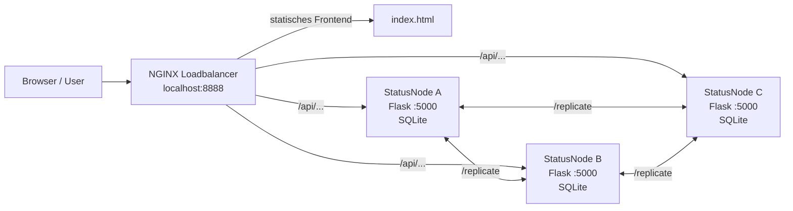

# Architektur-Blueprint - Verteiltes Commandcenter

## Zielbild

Das Projekt entwickelt sich vom einfachen Zwei-Node-PoC zu einem verteilten Commandcenter mit mehreren gleichwertigen Statusnodes. Ein Client arbeitet ueber eine zentrale URL und muss keine Node manuell auswaehlen. Der Loadbalancer verteilt API-Requests auf die aktiven Statusnodes. Jede Statusnode speichert Statusmeldungen lokal und persistent und repliziert Schreiboperationen an ihre konfigurierten Peers.

## Aktueller Arbeitsstand fuer Aufgabe 3



Der Browser ruft nur den Loadbalancer auf. Das Frontend wird direkt vom Loadbalancer ausgeliefert und spricht ausschliesslich relative `/api/...`-Pfade an. NGINX verteilt die API-Requests per Round-Robin auf `node-a`, `node-b` und `node-c`. Die Statusnodes sind nicht am Host exposed, sondern nur im Docker-Netzwerk erreichbar.

## Komponenten

| Komponente | Technologie | Aufgabe |
|---|---|---|
| Loadbalancer | NGINX | Zentrale URL, statisches Frontend, Proxy und Failover auf Backend-Nodes |
| StatusNode A/B/C | Python + Flask | CRUD-API, SQLite-Persistenz, Peer-Replikation, Bootstrap, Retry |
| Persistenz | SQLite (pro Node) | Lokaler, dauerhafter Speicher je Node, kein Shared-DB |
| Frontend | HTML + JavaScript | Status erfassen, Feed anzeigen, Delete ausloesen (Demo) |
| Docker Compose | Docker | Gemeinsames Netzwerk, Healthchecks, Volumes, Service-Start |

## Kommunikationswege

| Weg | Protokoll | Zweck |
|---|---|---|
| Browser -> Loadbalancer | HTTP | Single Point of Access |
| Loadbalancer -> StatusNode | HTTP/REST | Verteilung von API-Requests, Failover |
| StatusNode -> StatusNode | HTTP/REST | Push-Replikation nach Schreiboperationen |
| StatusNode -> StatusNode | HTTP/REST | Snapshot-Abruf beim Initial-Sync (`/internal/snapshot`) |

## Statusmodell

```json
{
  "username": "RECON-01",
  "statustext": "Am Weg zum Einsatz",
  "uhrzeit": "2026-06-02T12:00:00+00:00",
  "latitude": 48.215,
  "longitude": 16.385,
  "deleted": false,
  "originNode": "Node-A"
}
```

`username` ist der fachliche Key. Pro Username gibt es genau einen aktiven Status. Delete wird als Tombstone (`deleted: true`) gespeichert und repliziert, damit geloeschte Eintraege nicht durch alte Replikate wieder auftauchen.

## Konsistenz und Konfliktaufloesung

Das System strebt Eventual Consistency an. Die Konfliktregel ist Last-Writer-Wins anhand von `uhrzeit`:

- Ist ein eingehendes Update juenger, wird es uebernommen.
- Ist es aelter, wird es ignoriert (auch bei Replikation und Bootstrap).
- Bei exakt gleichem `uhrzeit` entscheidet deterministisch der `originNode` (lexikografisch), damit alle Nodes unabhaengig von der Reihenfolge konvergieren.

Diese Regel gilt einheitlich fuer Client-Schreibzugriffe, fuer empfangene Replikate und fuer den Initial-Sync.

## Persistenz

Jede Node haelt einen In-Memory-Cache fuer schnelle Lesezugriffe und spiegelt jeden Schreibvorgang in eine eigene SQLite-Datei. Beim Start laedt die Node den Cache aus SQLite. Im Container liegt die Datei unter `/data/status.db` auf einem Docker-Volume pro Node. Dadurch ueberlebt der Datenstand einen Container-Neustart, und es gibt keine gemeinsame oder verteilte Datenbank (Vorgabe der Angabe).

## Initial-Sync / Bootstrapping

Beim Start befindet sich eine Node in einer Grace Period:

1. `state=bootstrapping`, Client-Endpunkte antworten mit HTTP 503.
2. Die Node fragt nacheinander die Peer-Snapshots (`GET /internal/snapshot`) ab.
3. Jeder erhaltene Status wird per Last-Writer-Wins gemerged (inklusive Tombstones).
4. Nach erfolgreichem Sync oder Timeout wechselt die Node auf `state=ready`.

`/replicate`, `/internal/snapshot` und `/health` bleiben waehrend der Grace Period erreichbar, damit Peers weiterarbeiten koennen.

## Fehlertoleranz

- Faellt eine Node aus, leitet NGINX den Traffic auf die verbleibenden Nodes (Failover ohne URL-Wechsel).
- Schlaegt die Peer-Replikation fehl, bleibt der Client-Request erfolgreich; das Update wandert in eine Retry-Queue und wird durch einen Hintergrund-Worker nachgeliefert.
- Eine neu gestartete oder zuvor ausgefallene Node holt sich den aktuellen Stand ueber den Initial-Sync.

## Noch offen fuer das finale Projekt

- Finales React/Leaflet-Frontend mit Kartenansicht (eigener Arbeitspunkt des Teams).
- TLS am Loadbalancer und optional zwischen den Nodes (Bonus laut Aufgabe 3).
- Optional hochverfuegbarer Loadbalancer (Aktiv/Passiv), um den letzten SPoF zu eliminieren.
